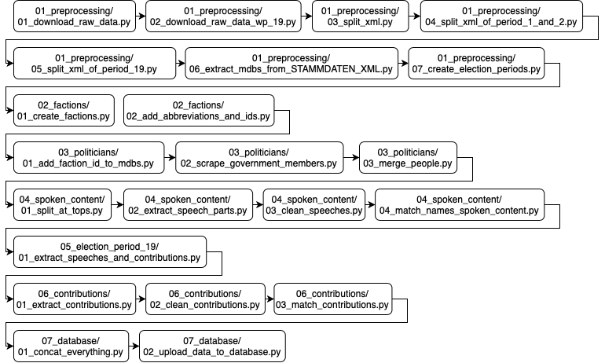

# Python Scripts Information

## General Information

The folders and the files are mostly sorted in the order of execution.

For the correct order of execution, please use our execution graph:

The Input and Output paths start at the project root

## 01_preprocessing

### 1. [Download Raw Data](./od_lib/01_preprocessing/01_download_raw_data.py)

- Function:

  - Downloads Zip folders that include XML files for plenary sessions in the electoral periods 1 to 18
  - Downloads XML file with the personal details for all Members of the Bundestag from the 1st to the 19th electoral period

- Attributes:
  - Input: `None`
  - Output: `./data/01_raw/xml/*`

### 2. [Download Raw Data ET 19](./od_lib/01_preprocessing/02_download_raw_data_electoral_term_19.py)

- Function:

  - Downloads XML files for plenary sessions in the 19th electoral period
  - New sessions have to be added manually

- Attributes:
  - Input: `None`
  - Output: `./data/02_cached/electoral_term_10/stage_01/*`

### 3. [Split XML](./od_lib/01_preprocessing/03_split_xml.py)

- Function:

  - A cleaning function checks the text corpus. It deletes things like the titles that were left from the pdf files, the XML files were generated from. The cleaning function can be found in [helper_functions/clean_text.py](./od_lib/helper_functions/clean_text.py)
  - Splits the XML files of the 3rd to 18th electoral period into the table of content, speech_content and appendix

- Attributes:
  - Input: `./data/01_raw/xml/*`
  - Output: `./data/01_raw/txt/*`

### 4. [Split XML ET 1 and 2](./od_lib/01_preprocessing/04_split_xml_electoral_term_1_and_2.py)

- Function:

  - A cleaning function checks the text corpus. It deletes things like the titles that were left from the pdf files, the XML files were generated from. The cleaning function can be found in [helper_functions/clean_text.py](./od_lib/helper_functions/clean_text.py)
  - Because of the "interesting" structure of the first two election periods, we use a different approach to split the XML files into the table of content, speech_content and appendix

- Attributes:
  - Input: `./data/01_raw/xml/*`
  - Output: `./data/01_raw/txt/*`

### 5. [Split XML ET 19](./od_lib/01_preprocessing/05_split_xml_electoral_term_19.py)

- Function:

  - Splits the XML file into table of content, speech_content and appendix based on the XML tags

- Attributes:
  - Input: `./data/02_cached/electoral_term_19/stage_01/*`
  - Output: `./data/02_cached/electoral_term_19/stage_02/*`

### 6. [Extract MPs from personal details](./od_lib/01_preprocessing/06_extract_mps_from_mp_base_data.py)

- Function:

  - Parses the personal details into a Dataframe

- Attributes:
  - Input: `./data/01_raw/MP_BASE_DATA/MDB_STAMMDATEN.XML`
  - Output: `./data/02_cached/politicians/stage_01/mps.pkl`

### 7. [Create Electoral Terms](./od_lib/01_preprocessing/07_create_electoral_terms.py)

- Function:

  - Creates the Electoral Terms Dataframe

- Attributes:
  - Input: `None`
  - Output: `./data/03_final/electoral_terms.csv`

## Factions

### 1. [Create Factions](./od_lib/02_factions/01_create_factions.py)

- Function:

  - Uses the `mps` Dataframe to extract unique factions and manually adds factions that show up in the speeches but not in the Dataframe

- Attributes:
  - Input: `./data/02_cached/politicians/stage_01/mps.pkl`
  - Output: `./data/02_cached/factions/stage_01/factions.pkl`

### 2. [Add Abbreviations](./od_lib/02_factions/02_add_abbreviations_and_ids.py)

- Function:

  - Add Abbreviations to the factions Dataframe

- Attributes:
  - Input: `./data/02_cached/factions/stage_01/factions.pkl`
  - Output: `./data/03_final/factions.pkl`

## Politicians

### 1. [Add Faction IDs to MPs](./od_lib/03_politicians/01_add_faction_id_to_mps.py)

- Function:

  - Assigns the according faction id to every politician

- Attributes:
  - Input:
    - `./data/02_cached/politicians/stage_01/mps.pkl`
    - `./data/03_final/factions.pkl`
  - Output: `./data/02_cached/politicians/stage_02/mps.pkl`

### 2. [Scrape the Government Members](./od_lib/03_politicians/02_scrape_mgs.py)

- Function:

  - Scrapes every Government Member off of Wikipedia

- Attributes:
  - Input: `None`
  - Output: `./data/02_cached/politicians/stage_01/mgs.pkl`

### 3. [Merge Politicians](./od_lib/03_politicians/03_merge_politicians.py)

- Function:

  - Merges the `mps.pkl`and `mgs.pkl` Dataframe

- Attributes:
  - Input:
    - `./data/02_cached/politicians/stage_02/mps.pkl`
    - `./data/02_cached/politicians/stage_01/mgs.pkl`
    - `./data/03_final/factions.pkl`
  - Output: `./data/03_final/politicians.csv`

## Spoken Content

### 1. [Extract Speeches](./od_lib/04_speech_content/01_extract_speeches.py)

- Function:

  - Searches for Speaches in the Corpus using Regex Patterns.

- Attributes:
  - Input: `./data/01_raw/txt/*`
  - Output: `./data/02_cached/speech_content/stage_01/*`
  - File Format:
    - speech_content:
      | session | name_raw | position_raw | constituency | speech_content | span_begin | span_end |
      | --- | --- | --- | --- | --- | --- | --- |
      | 18245 | Peter Schmidt | CDU/CSU | | Sehr geehrter (Hans Müller [AfD]: Fisch! - Beifall bei der SPD - Links)... | 0.0 | 255.0 |
      | ... | ... | ... | ... | ... | ... | ... |

### 2. [Clean Speeches](./od_lib/04_speech_content/02_clean_speeches.py)

- Function:

  - Splits the Full Name into First- and Last-Name
  - Assigns a Faction ID
  - Parses the Position into `position_long` and `position_short`

- Attributes:
  - Input:
    - `./data/02_cached/speech_content/stage_01/*`
    - `./data/03_final/factions.pkl`
  - Output: `./data/02_cached/speech_content/stage_02/*`
  - File Format:
    - speech_content:
      | session | position_short | position_long | last_name | first_name | acad_title | faction_id | constituency | speech_content | span_begin | span_end |
      | --- | --- | --- | --- | --- | --- | --- | --- | --- | --- | --- |
      | 18245 | Member of Parliament | | Schmidt | ['Peter'] | [] | 4 | | Sehr geehrter (Hans Müller [AfD]: Fisch! - Beifall bei der SPD - Links)... | 0.0 | 255.0 |
      | ... | ... | ... | ... | ... | ... | ... | ... | ... | ... | ... |

### 3. [Match Names](./od_lib/04_speech_content/03_match_names_speeches.py)

- Function:

  - Assigns a People ID to every Speaker

- Attributes:
  - Input:
    - `./data/02_cached/speech_content/stage_03/*`
    - `./data/03_final/politicians.csv`
  - Output: `./data/02_cached/speech_content/stage_03/*`
  - File Format:
    - speech_content:
      | session | position_short | position_long | politician_id | last_name | first_name | acad_title | faction_id | constituency | speech_content | span_begin | span_end |
      | --- | --- | --- | --- | --- | --- | --- | --- | --- | --- | --- | --- |
      | 18245 | Member of Parliament | | 1109312 | Schmidt | ['Peter'] | [] | 4 | | Sehr geehrter (Hans Müller [AfD]: Fisch! - Beifall bei der SPD - Links)... | 0.0 | 255.0 |
      | ... | ... | ... | ... | ... | ... | ... | ... | ... | ... | ... |

## Election Period 19

### 1. [Extract Speeches and Contributions Period 19](./od_lib/05_electoral_term_19/01_extract_speeches_and_contributions_electoral_term_19.py)

- Function:

  - Speeches are extracted from the XML Structure
  - Searches for Contributions in the Speeches using Regex Pattern
  - The Script replaces Contributions in the speech_content with an Identifier
  - The extract_contribution funciton can be found in [helper_functions/extract_contributions.py](./od_lib/helper_functions/extract_contributions.py)

- Attributes:

  - Input: `./data/02_cached/electoral_term_19/stage_02/*`
  - Output:
    - `./data/02_cached/electoral_term_19/stage_03/speech_content/speech_content.pkl`
    - `./data/02_cached/contributions_extended/stage_01/*`
    - `./data/03_final/contributions_simplified.pkl`
  - File Format:
    - speech_content:
      | id | session | position_short | position_long | politician_id | last_name | first_name | faction_id | speech_content | date |
      | --- | --- | --- | --- | --- | --- | --- | --- | --- | --- |
      | 1052836 | 18245 | Member of Parliament | | 1109312 | Schmidt | ['Peter'] | 4 | Sehr geehrter ({0})... | 1.608163e+09 |
      | ... | ... | ... | ... | ... | ... | ... | ... | ... | ... |
    - contributions_extended:
      | id |  type | name | faction | constituency | content | text_position |
      | --- | --- | --- | --- | --- | --- | --- |
      | 0 | Beifall | | SPD | | | 0 |
      | 1 | Personen-Einruf | Hans Müller | AfD | | Fisch! | 0 |
      | ... | ... | ... | ... | ... | ... | ... |

## Contributions

### 1. [Extract Contributions](./od_lib/06_contributions/01_extract_contributions.py)

- Function:

  - Searches for Contributions in the Speeches using Regex Pattern
  - The Script replaces Contributions in the speech_content with an Identifier
  - The extract_contribution funciton can be found in [helper_functions/extract_contributions.py](./od_lib/helper_functions/extract_contributions.py)

- Attributes:

  - Input: `./data/02_cached/speech_content/stage_03/*`
  - Output:
    - `./data/02_cached/speech_content/stage_04/*`
    - `./data/02_cached/contributions_extended/stage_01/*`
    - `./data/03_final/contributions_simplified.pkl`
  - File Format:
    - speech_content:
      | speech_id | session | position_short | position_long | politician_id | last_name | first_name | acad_title | faction_id | constituency | speech_content | span_begin | span_end |
      | --- | --- | --- | --- | --- | --- | --- | --- | --- | --- | --- | --- | --- |
      | 1052836 | 18245 | Member of Parliament | | 1109312 | Schmidt | ['Peter'] | | 4 | | Sehr geehrter ({0})... | 0.0 | 255.0 |
      | ... | ... | ... | ... | ... | ... | ... | ... | ... | ... | ... | ... | ... |
    - contributions_extended:
      | id |  type | name_raw | faction | constituency | content | text_position |
      | --- | --- | --- | --- | --- | --- | --- |
      | 0 | Beifall | | SPD | | | 0 |
      | 1 | Personen-Einruf | Hans Müller | AfD | | Fisch! | 0 |
      | ... | ... | ... | ... | ... | ... | ... |

### 2. [Clean Contributions Extended](./od_lib/06_contributions/02_clean_contributions_extended.py)

- Function:

  - Splits the Full Name into First- and Last-Name
  - Cleans the Party name and assigns a Faction ID

- Attributes:
  - Input:
    - `./data/02_cached/contributions_extended/stage_01/*`
    - `./data/03_final/politicians.csv`
  - Output: `./data/02_cached/contributions_extended/stage_02/*`
  - File Format:
    - contributions_extended:
      | id | type | name_raw | faction_id | faction | last_name | first_name | acad_title | constituency | content | text_position |
      | --- | --- | --- | --- | --- | --- | --- | --- | --- | --- | --- |
      | 0 | Beifall | | 23 | SPD | | [] | [] | | | 0 |
      | 1 | Personen-Einruf | Hans Müller | 0 | AfD | Müller | ['Hans'] | [] | | Fisch! | 0 |
      | ... | ... | ... | ... | ... | ... | ... | ... | ... | ... | ... |

### 3. [Match Contributions](./od_lib/06_contributions/03_match_contributions_extended.py)

- Function:

  - Assigns a People ID to every Contribution

- Attributes:
  - Input:
    - `./data/02_cached/contributions_extended/stage_01/*`
    - `./data/03_final/politicians.csv`
  - Output: `./data/02_cached/contributions_extended/stage_02/*`
  - File Format:
    - contributions_extended:
      | id | type | name_raw | faction_id | politician_id | faction | last_name | first_name | acad_title | constituency | content | text_position |
      | --- | --- | --- | --- | --- | --- | --- | --- | --- | --- | --- | --- |
      | 0 | Beifall | | 23 | -1 | SPD | | [] | [] | | | 0 |
      | 1 | Personen-Einruf | Hans Müller | 0 | 1109373 | AfD | Müller | ['Hans'] | [] | | Fisch! | 0 |
      | ... | ... | ... | ... | ... | ... | ... | ... | ... | ... | ... | ... |

## Database

### 1. [Concat Everything](./od_lib/07_database/01_concat_everything.py)

- Function:

  - Concats every speech_content DataFrame into one single DataFrame. Does this for contributions as well
  - Removes unnecessary columns from DataFrames
  - Generates new columns, e.g. id

- Attributes:

  - Input:
    - `./data/01_raw/xml/*`
    - `./data/02_cached/speech_content/stage_04/*`
    - `./data/02_cached/electoral_term_19/stage_03/speech_content/speech_content.pkl`
    - `./data/02_cached/contributions_extended/stage_03/*`
  - Output:
    - `./data/03_final/speech_content.pkl`
    - `./data/03_final/contributions_extended.pkl`
  - File Format:

    - speech_content:
      | id | electoral_term | session | position_short | position_long | politician_id | last_name | first_name | faction_id | speech_content | document_url | date |
      | --- | --- | --- | --- | --- | --- | --- | --- | --- | --- | --- | --- |
      | 1052836 | 18 | 245 | Member of Parliament | | 1109312 | Schmidt | Peter | 4 | Sehr geehrter ({0})... | <https://dip21.bundestag.de/dip21/btp/18/18245.pdf> | 1.608163e+09 |
      | ... | ... | ... | ... | ... | ... | ... | ... | ... | ... | ... | ... | ... |
    - contributions_extended:
      | id | type | faction_id | speech_id | politician_id | last_name | first_name | content | text_position |
      | --- | --- | --- | --- | --- | --- | --- | --- | --- |
      | 0 | Beifall | 23 | 1052836 | -1 | | | | 0 |
      | 1 | Personen-Einruf | 0 | 1052836 | 1109373 | Müller | Hans | Fisch! | 0 |
      | ... | ... | ... | ... | ... | ... | ... | ... | ... |

### 2. [Upload Data to Database](./od_lib/07_database/02_upload_data_to_database.py)

- Function:

  - Uploads every Dataframe in `./data/03_final` to the Database

## Topic Modelling

The Topic Modelling is still WIP and most scripts for handling the Data Cubes are still in a prototype phase and are not yet published.

In the meanwhile you can download and move the following files into the `./data/03_final` folder:

- [dims.pkl](https://open-discourse-data-cubes.s3.eu-central-1.amazonaws.com/dims.pkl)
- [data_cube.pkl](https://open-discourse-data-cubes.s3.eu-central-1.amazonaws.com/data_cube.pkl)
- [weight_cube.pkl](https://open-discourse-data-cubes.s3.eu-central-1.amazonaws.com/weight_cube.pkl)
- [politician_dims.pkl](https://open-discourse-data-cubes.s3.eu-central-1.amazonaws.com/politician_dims.pkl)
- [politician_data_cube.pkl](https://open-discourse-data-cubes.s3.eu-central-1.amazonaws.com/politician_data_cube.pkl)
- [politician_weight_cube.pkl](https://open-discourse-data-cubes.s3.eu-central-1.amazonaws.com/politician_weight_cube.pkl)

You can track the development of the Topic Modelling using this [GitHub Issue](https://github.com/open-discourse/open-discourse/issues/74)

...

### [Upload Data Cubes to Database](./od_lib/topic_modelling/upload_data_cubes.py)

- Function:

  - Uploads every DataCube in `./data/03_final` to the Database
